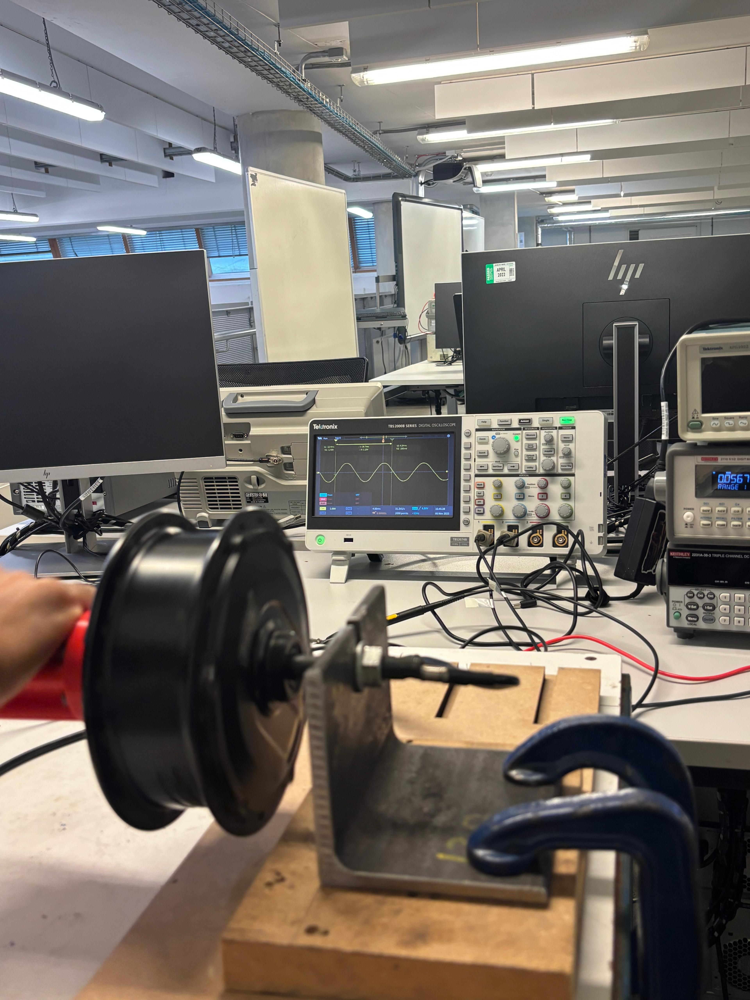
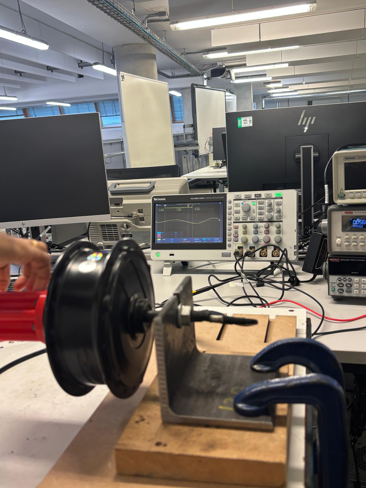
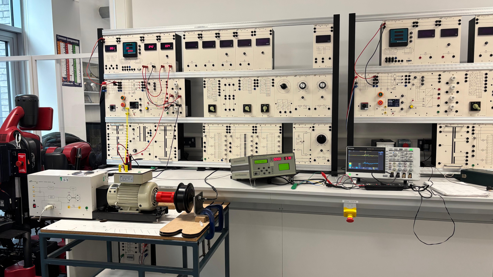
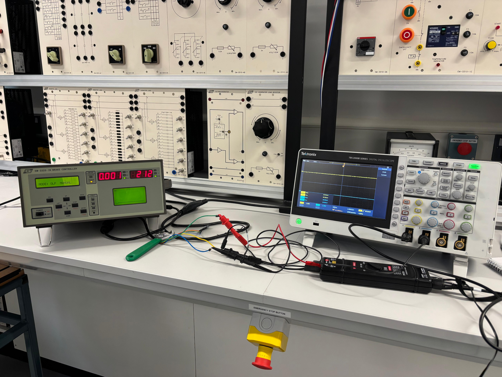

# 🚗 Shell Eco-Marathon — PMSM Motor Performance Analysis

> Powertrain & Motor Performance Engineering | Coventry University | 2025

## 📌 Project Overview
Experimental performance analysis of a Permanent Magnet Synchronous Motor (PMSM) 
for an ultra-efficient electric vehicle competing in Shell Eco-Marathon 2025. 
The project focused on drivetrain optimisation to maximise energy efficiency 
under real competition conditions.

**🏆 Result: Top 5 finish at Shell Eco-Marathon 2025 (Propulsion Division)**

---

## ⚙️ Key Responsibilities
- Evaluated PMSM torque, current, power factor, and efficiency under varying loads
- Used MATLAB and Simulink to analyse test data and model drivetrain performance
- Conducted LCR testing to verify electrical properties of motor windings
- Captured and analysed oscilloscope waveforms during motor performance testing
- Reviewed drivetrain outputs against Shell Eco-Marathon efficiency requirements
- Collaborated with control, chassis, and electrical sub-teams

---

## 🛠️ Tools & Technologies
| Tool | Purpose |
|------|---------|
| MATLAB | Data analysis & performance modelling |
| Simulink | Drivetrain simulation |
| Tektronix Oscilloscope | Live waveform capture & signal analysis |
| LCR Meter | Motor winding inductance, capacitance & resistance testing |
| PMSM Test Rig | Motor performance measurement |
| Sensors & Instrumentation | Electrical measurement & data capture |

---

## 📸 Project Photos

### Motor Test Setup — Tektronix Oscilloscope & PMSM Rig

*PMSM motor mounted on test rig with Tektronix digital oscilloscope 
displaying live voltage waveforms — Coventry University Engineering Lab*

### Motor Setup

### Oscilloscope Outputs

---

## 🎥 Project Videos

### 1️⃣ PMSM Motor Testing Process

### 2️⃣ LCR Motor Component Testing

---

## 📁 Project Documents
- 📄 [Final Report](Shell_Eco_Marathon_Final.pdf)
- 📊 [Presentation Slides](Shell_Eco_Marathon_Presentation.pptx)
- 📋 [Project Proposal](Shell_Eco_Marathon_Project_Proposal.docx)

---

## 📊 Key Outcomes
- Achieved measurable improvement in drivetrain energy efficiency
- Validated motor performance against defined competition targets
- Verified motor winding properties through LCR testing
- Captured real electrical waveforms using Tektronix oscilloscope
- **Top 5 finish at Shell Eco-Marathon 2025 (Propulsion Division)**

---

## 👤 Author
**Vignesh Munusamy**
MSc Electrical & Electronic Engineering — Coventry University
📧 Vignesh200210@gmail.com
🔗 [LinkedIn](https://linkedin.com/in/vignesh-munusamy-b0860325b)
🐙 [GitHub](https://github.com/Vignesh-munusamy-eee)
